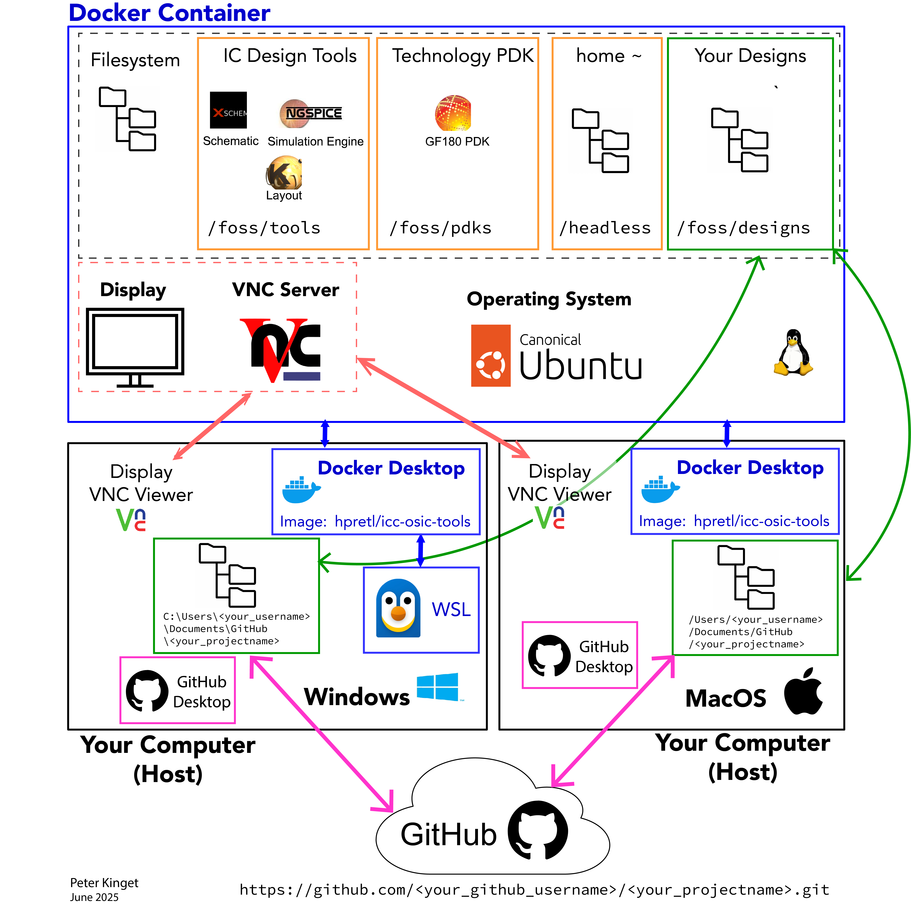
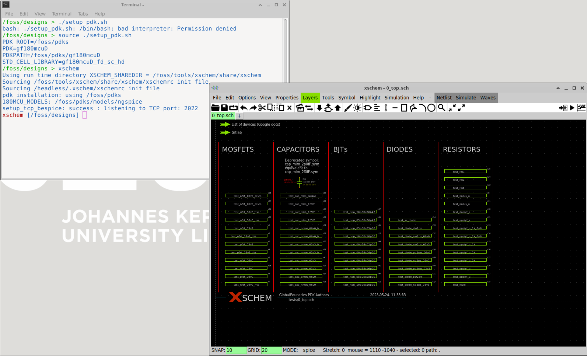

# Installing the Open-Source IC Design Tools for Analog Design using a GitHub Project Repo

## Preamble
- Read through this whole document first to get a sense of the various steps involved. 

- Then get a sense of the overall *constellation* by reviewing this figure:



## Installation: Windows-Only Step 

> Mac users can skip this step and proceed to **Steps for both Windows and MacOS**.  

### Installing Windows System for Linux (WSL) with Ubuntu

- Open a `cmd` window:

```
wsl --install
```
```
Installing: Windows Subsystem for Linux
Windows Subsystem for Linux has been installed.
Installing: Ubuntu
Ubuntu has been installed.
The requested operation is successful. Changes will not be effective until the system is rebooted.

C:\Users\peter>
```

- Reboot your windows machine, upon reboot it will continue with the installation:

```
Downloading: Ubuntu
Installing: Ubuntu
Distribution successfully installed. It can be launched via 'wsl.exe -d Ubuntu'
Launching Ubuntu...
Provisioning the new WSL instance Ubuntu
This might take a while...
```
- Create a user account for your Ubuntu linux install:

```
Create a default Unix user account: <your_linux_username>
New password:
Retype new password:
passwd: password updated successfully
```
- You will see something like this in the terminal
```
<your_linux_username>@<your_windows_computername>:/mnt/c/Windows/system32$
```

- Change to home folder `~`

```
cd 
```

## Installation: Steps for Both Windows and MacOS

## Docker Desktop

- Install **Docker Desktop** on your Windows/MacOS host
    - Download Docker Desktop from https://docs.docker.com/desktop/ 
        - choose version for your host OS
    - run installer (takes time ...)
    - Reboot
    - Sign in with docker account

## GitHub Desktop

- Install **GitHub Desktop** on your Windows/MacOS host
- Log in to your GitHub account

## Create & Clone GitHub Repo

- At `https://github.com/<your_github_accountname>`, create your **GitHub project repo** using the template [iic-osic-tools-project-template](https://github.com/Jianxun/iic-osic-tools-project-template).

- Clone your project repo using GitHub Desktop into your Windows/MacOS host's file system; we will refer to this folder as your *project repo folder*. When using default GitHub Desktop settings, it will be something like this:

<div style="display: flex; gap: 2em; width: 100%;">
  <div style="flex: 1;">
    <h4>Windows</h4>
    <pre><code>c:\Users\&ltyour_win_username&gt\Documents\GitHub\&ltyour-repo&gt</code></pre>
  </div>
  <div style="flex: 1;">
    <h4>MacOS</h4>
    <pre><code>/Users/&ltyour_mac_username&gt/Documents/GitHub/&ltyour_repo&gt</code></pre>
  </div>
</div>

## Install Docker Image and Create Container

- Open Command Prompt `cmd` (Windows) or `terminal` (Mac) and go to your project repo folder.

- You should see the following if you list the files in the folder: 

```
> ls -ltra
total 80
 8 -rw-r--r--   1 <your_username>  staff   206B Jun 11 16:48 .editorconfig
 8 -rw-r--r--   1 <your_username>  staff   475B Jun 11 16:48 .gitattributes
 8 -rw-r--r--   1 <your_username>  staff   310B Jun 11 16:48 .gitignore
 8 -rw-r--r--   1 <your_username>  staff   1.0K Jun 11 16:48 LICENSE
24 -rw-r--r--   1 <your_username>  staff   9.0K Jun 11 16:48 README.md
 8 -rw-r--r--   1 <your_username>  staff   3.9K Jun 11 16:48 start_vnc.bat
16 -rwxr-xr-x   1 <your_username>  staff   5.5K Jun 11 16:48 start_vnc.sh*
 0 drwxr-xr-x   3 <your_username>  staff    96B Jun 11 16:48 scripts/
 0 drwxr-xr-x   4 <your_username>  staff   128B Jun 11 16:48 docs/
 0 drwxr-xr-x  13 <your_username>  staff   416B Jun 11 16:51 .git/
 0 drwxr-xr-x   9 <your_username>  staff   288B Jun 12 10:57 designs/
 0 drwxr-xr-x  13 <your_username>  staff   416B Jun 12 10:57 ./
 0 drwxr-xr-x  13 <your_username>  staff   416B Jun 13 18:56 ../

```

- Execute:

<div style="display: flex; gap: 2em; width: 100%;">
  <div style="flex: 1;">
    <h4>Windows</h4>
    <pre><code>.\start_vnc.bat</code></pre>
  </div>
  <div style="flex: 1;">
    <h4>MacOS</h4>
    <pre><code>./start_vnc.sh</code></pre>
  </div>
</div>

- When executing this the first time, you will need to wait a long time for the docker *image* `htpretl/iic-osic-tools` to be downloaded; check the progress bars; here is what you see on a Windows machine and the output for MacOS is very similar. 

```
C:\Users\<your_username>\Documents\GitHub\<your_project_repo> .\start_vnc.bat
Using/creating designs directory: C:\Users\<your_username>\Documents\GitHub\<your_project_repo>\designs
Webserver port set to 80
VNC port set to 5901
xhost is not detected / not in PATH. Please verify X-server access control!
Container does not exist, creating iic-osic-tools_xvnc ...
Unable to find image 'hpretl/iic-osic-tools:latest' locally
latest: Pulling from hpretl/iic-osic-tools
0f5e1a059722: Pulling fs layer
7794480d3c11: Pulling fs layer
9d47018b9aeb: Pulling fs layer
6a7a9b4e0ce8: Pulling fs layer
....
e9dbe85a759a: Pull complete
9d6de437e4db: Pull complete
03c390e0aacd: Pull complete
f435f87f4c03: Pull complete
6a2d6ae42932: Pull complete
0ab6164053fe: Pull complete
375987dde304: Pull complete
eaee5ddf2105: Pull complete
Digest: sha256:255bf50e5b12fd0c01049acb3a549b84ddbc4f33b87a7f352218dde90131e509
Status: Downloaded newer image for hpretl/iic-osic-tools:latest
bba498d3f002f24bd5c15723471f8885981fc6b79c65c4c8a42142a23d7a414a
```
## Accessing the Container's Screen

### Accesss through a Browser

You can first access the container through a web browser which does not require any additional software installs. Verify that the container is running: point your browser to [http://localhost:80](http://localhost:80), enter the password `abc123` and you should see the linux desktop. 

### Access through VNC (Recommended)

- Install **TigerVNC** on your host machine

- Open *TigerVNC Viewer* to port `localhost:5901` and enter password `abc123`

## Installing `gf180mcuD` PDK in the Container

- Make sure your container is running and connect through the browser or VNC. 

- Open a Terminal (right click on the desktop) in linux and execute: 
```
> source ./setup_pdk.sh
```
- Open the schematic editor
```
> xschem
```
You should get an example schematic with various demo schematics to characterize various devices in the gf180mcuD technology. Follow the instructions in the schematic. 

## Conclusion

You now have a basic setup of the open source tools for schematic entry and simulation. Lateron, we will add the layout and verification tools. 



## Postscript Notes
### Windows: 

#### WSL vs Windows Home Folder
WSL: `/home/linux-username/` <-> `\\wsl$\Ubuntu\home\linux-username`

Windows: `C:\Users\win-username\` <-> `/mnt/c/Users/win-username`

#### Docker Mount Volumes
- mount windows drives, i.e. from `c:\Users\win-username` - this is faster!


