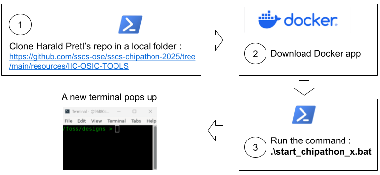
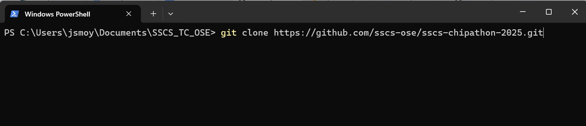
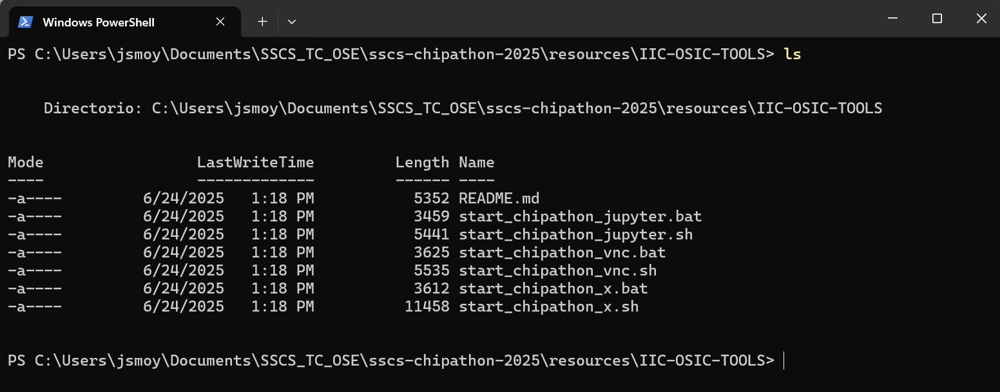
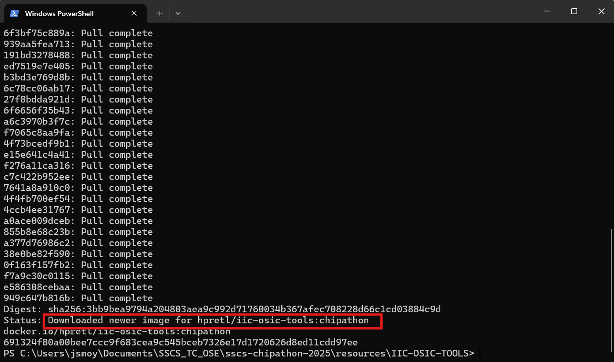

# Installation Instructions for Windows - More Advanced Workflow

Juan Moya, June 2025. 

# Installation Steps for Windows

The Docker image used in this version is a pre-packaged Docker container (**IIC-OSIC-TOOLS**) provided by Harald Pretl's lab for 2025 Chipathon: https://github.com/sscs-ose/sscs-chipathon-2025/tree/main/resources/IIC-OSIC-TOOLS

First, a block diagram with the main installation steps:
<p align="center">
   
</p>  

GUI-based tool setup:

1) Assuming that you have installed on your Windows machine **<ins>Windows Powershell</ins>**:

   a) Create a folder where you will pull 2025 Chipathon Docker image.

   b) Clone 2025 Chipathon Docker image from: https://github.com/sscs-ose/sscs-chipathon-2025/tree/main/resources/IIC-OSIC-TOOLS with the following command:
  ```
  git clone https://github.com/sscs-ose/sscs-chipathon-2025.git
  ```
<p align="center">
   
</p>  

2) Download Docker: https://docs.docker.com/desktop/setup/install/windows-install/

Enable *Use WSL 2 instead of Hyper-V and **<ins>do not enable</ins>** "Allow Windows Containers".
<p align="center">
   
</p>  

3) Go to the local folder where the Docker image was cloned. Then, go to the  **IIC-OSIC-TOOLS** as indicated in the figure below.

<p align="center">
   
</p>  

  
6) Then, run the following command:
  ```
  .\start_chipathon_x.bat
  ```

After the command finalizes pulling the image, check that the Docker image downloaded is **:chipathon** as indicated in the figure below.

<p align="center">
   
</p>  

There are two other scripts that can be run based on your preferences, as indicated in:

https://github.com/sscs-ose/sscs-chipathon-2025/blob/main/docs/install_instructions/Windows/install_docker_desktop.md
