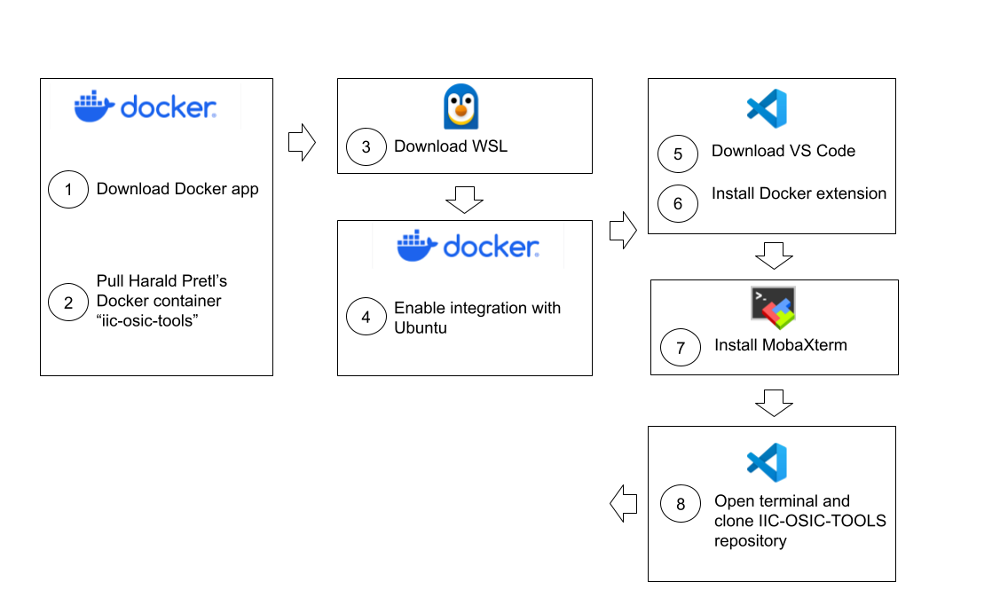

# Installation steps

The Docker image used in this 2025 Chipathon is pre-packaged Docker container provided by Harald Pretl's lab **IIC-OSIC-TOOLS**: https://github.com/iic-jku/iic-osic-tools

First, a block diagram with the main installation steps:
<p align="center">
   
</p>  

GUI-based tool setup:
1) Download Docker: https://www.docker.com/get-started/

  a) Enable *Use WSL 2 instead of Hyper-V (recommended)* as indicated in Kwantae Kim's tutorial: https://kwantaekim.github.io/2024/05/25/OSE-Docker/#in--windows

2) Search and pull Harald Pretl's container in Docker app: *iic-osic-tools* (it will take a couple of minutes).

3) Download and install Windows Subsystem for Linux (WSL).
   
a) Open WSL and run:
```
   wsl -l -v
```
4) In the Docker app, enable integration with Ubuntu.

5) Download and install VS Code: https://code.visualstudio.com/

6) Install Docker extension in VS Code

7) Download and install MobaXterm: https://mobaxterm.mobatek.net/

   MobaXterm allows users to run graphical applications on a remote server and display them locally, typically over an encrypted SSH connection.

8) Open VS Code, open the terminal and **<ins>open a new  Ubuntu WSL terminal</ins>**.

  a) Create a folder where you will pull Harald Pretl's Docker image.

  b) Clone Harald Pretl's Docker image from: https://github.com/iic-jku/iic-osic-tools with the following command:
  ```
  git clone https://github.com/iic-jku/IIC-OSIC-TOOLS.git
  ```

9) To allow us to run Docker by using WSL terminal, run the following line in the WSL terminal:
  ```
  sudo chmod 666 /var/run/docker.sock
  ```

10) Execute the following command in the WSL terminal:
  ```
  ./start_vnc.sh
  ```
