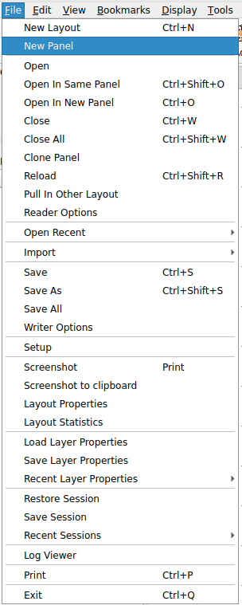
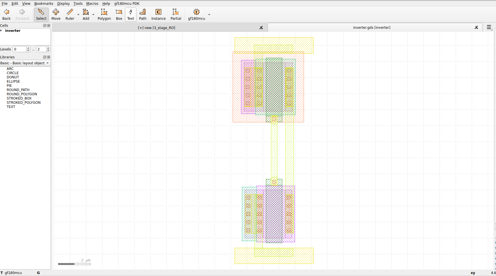
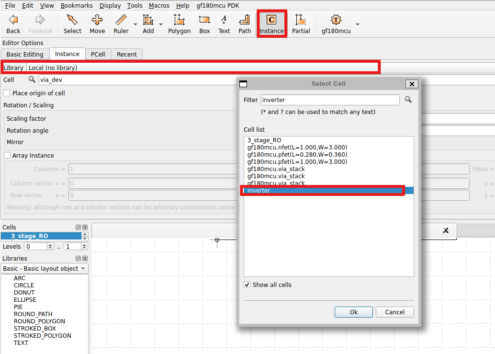
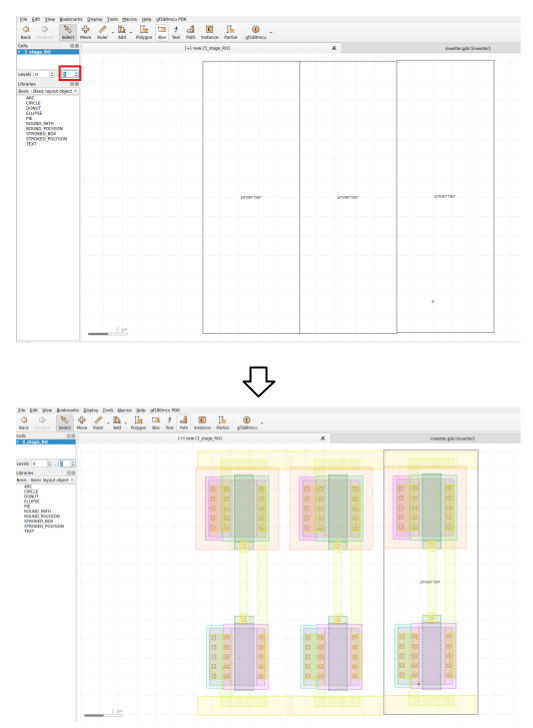
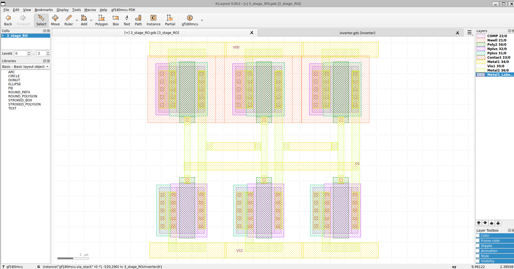
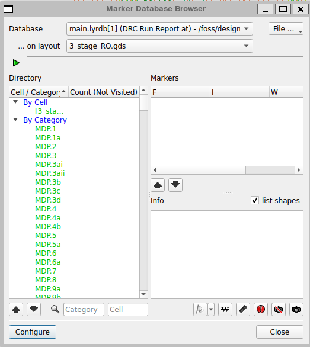

### Starting with Klayout 

This tutorial focuses on creating a layout with two levels of hierarchy, as it is known that the ring oscillator is composed of three inverter sub-cells. 

To open Klayout in editor mode, use the following command:
```
klayout -e
```

Follow the instructions described in the inverter project to set Klayout properly for the ring oscillator gds file (3_stage_RO) https://github.com/JuanMoya/Chipathon2025_gf180/tree/main/gf180_examples/inverter/gds

Open a new panel and open the inverter gds created previously, as shown below.

<p align="center">
   
</p> 

<p align="center">
   
</p> 

Then in the inverter.gds file, follow the steps below to copy the inverter layout into the 3_stage_RO layout.

<p align="center">
   
</p> 

Then, in order to instantiate the inverter cell in the 3_stage_RO layout, click on **Instance**, then select *Local (no library)* in the **Library** menu and finally select the inverter in the "Select Cell". This step-by-step is indicated below.

<p align="center">
   
</p>

Finally, change the hierarchy visualization with the level option (1 --> 3 for this case) as illustrated below:
<p align="center">
   
</p>

Below is the layout of the ring oscillator and the window confirming DRC clean.
<p align="center">
   
</p>

<p align="center">
   
</p>
