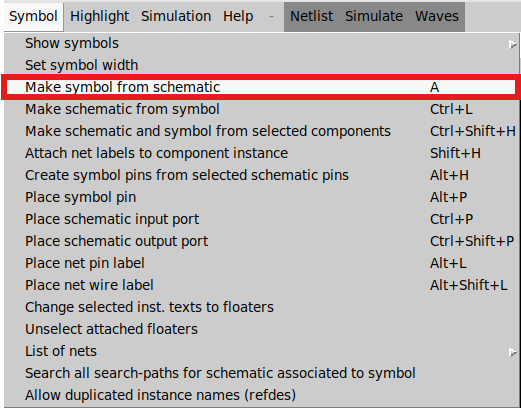
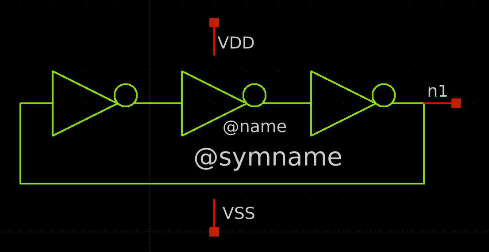

## 3_stage_RO.sch
This is a hierarchical example that uses the inverter shown above. First, create a new schematic with three inverters cascaded, as shown below. Open the library symbol using the "Shift + I" key combination, navigate to the folder containing the inverter symbol, and place it in the schematic window.

 

   

 

Once the schematic is ready, click on the **Symbol** button and select the *Make symbol from schematic* option, as illustrated below.

 

   

 

 

   

 

Then, create the test bench as shown below. Include an initial condition for node *n1* to make the ring oscillator start oscillating in Xschem (check the code line).

 

   

 

The figure below shows the code used to plot the three phases of the ring oscillator: **plot n1 x1.n2 x1.n3**. Note that nodes n2 and n3 are internal nodes. To plot them, indicate that they are internal nodes inside the x1 symbol, which corresponds to the ring oscillator symbol.

 

   

 
