### Starting with Klayout 

To open Klayout in editor mode, use the following command:
```
klayout -e
```
Click on **File** and then in **New Layout** to create a new layout, as indicated below.

<p align="center">
   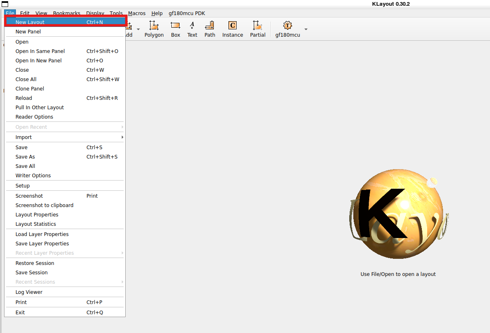
</p> 

In the *New Layout Properties* menu, set *Top cell* with the same name as the cell designed in Xschem and set *Database unit* to 0.001 um, as show below.

<p align="center">
   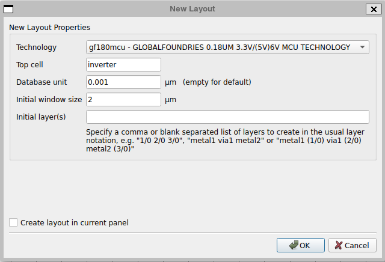
</p> 

Go to *Editor options* to set the grid, as illustrated below.

<p align="center">
   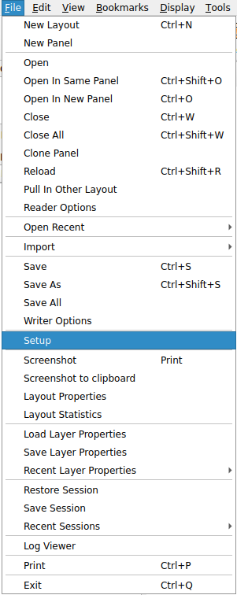
</p> 

Then define the grid to 0.005 um, as indicated below.

<p align="center">
   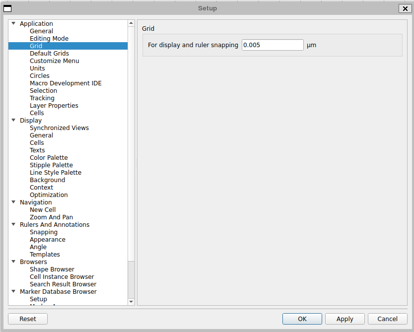
</p> 

Now, click on the **Edit** button and click on the *Editor Options* to set *Movements* option to move the cells in *Any Direction*, *Diagonal*, and *Manhattan* (which corresponds to X-Y 90° movement), as illustrated below.

<p align="center">
   
</p> 

<p align="center">
   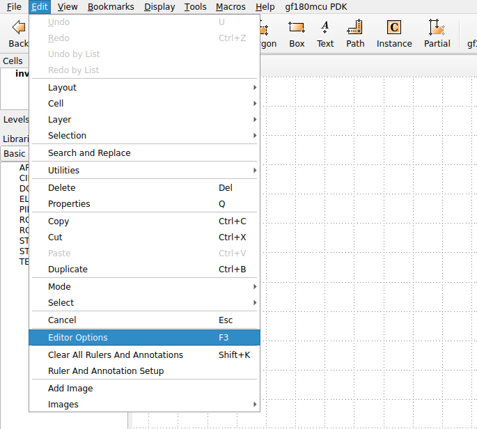
</p> 

<p align="center">
   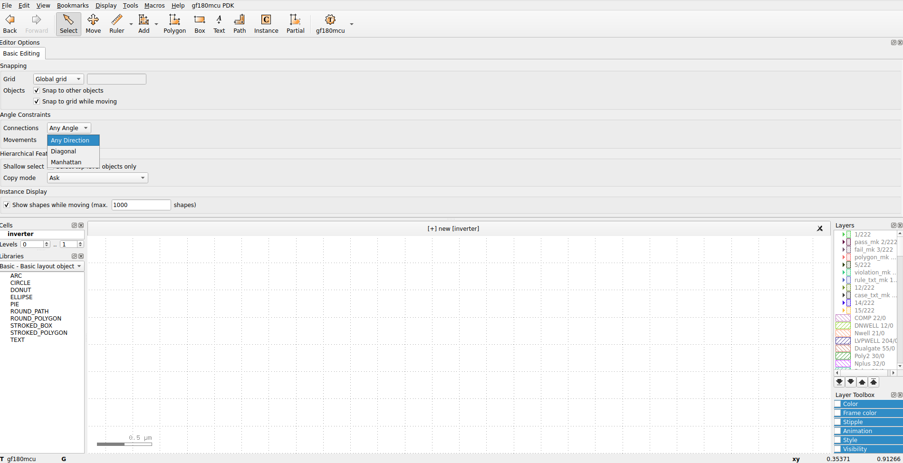
</p> 

To save the file, go to **File** and then click on *Save as*. Then, name the gds file with the same name as the Xschem file.

<p align="center">
   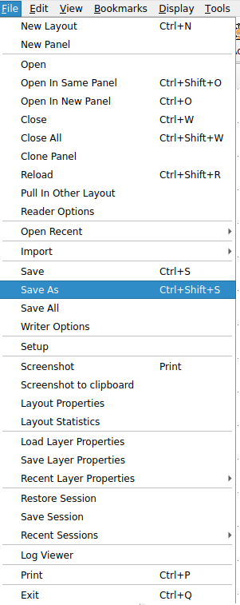
</p> 

<p align="center">
   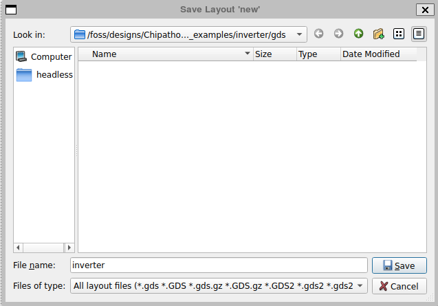
</p> 

To place the Pcells associated with the PDK cells in the layout area, click on  **Instance**, then in the *Library* option, and select *gf180mcu - GF180MCU Pcells*. This, will allow to select the different pcells associated with the PDK.

<p align="center">
   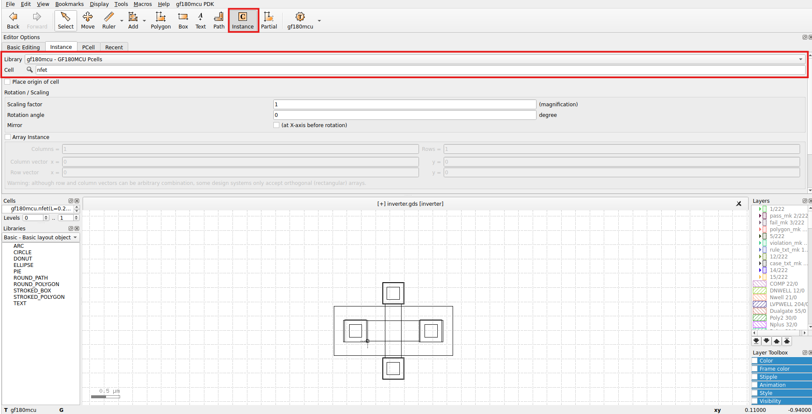
</p> 

To change the properties of the cell to be instantiated, select the **PCell** option and set the same parameters as the ones in the schematic. This could be also done after instantiating the cell in the layout area, by click in the cell, pressing **Q**, and then selecting the *Pcell Parameters* option. The two options mentioned are shown below.

<p align="center">
   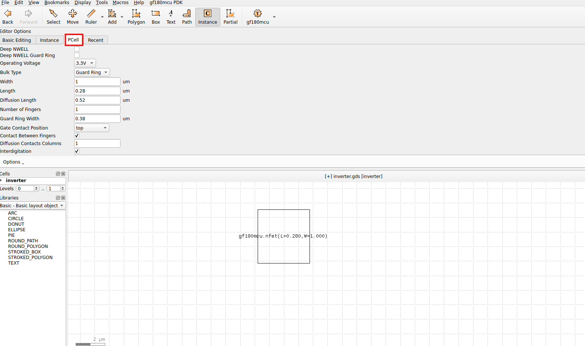
</p> 

<p align="center">
   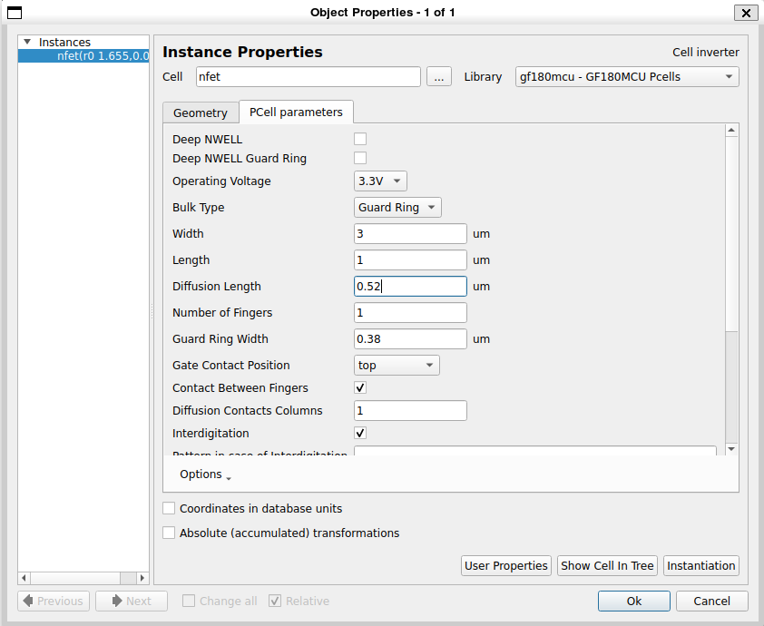
</p> 

To move or rotate the devices instantiated, select (left click with the mouse) the device you want to move and click on **Edit**, then *Selection*, and finally click on the option you are looking for (in the image below, I selected the option *Flip Vertically*). 

<p align="center">
   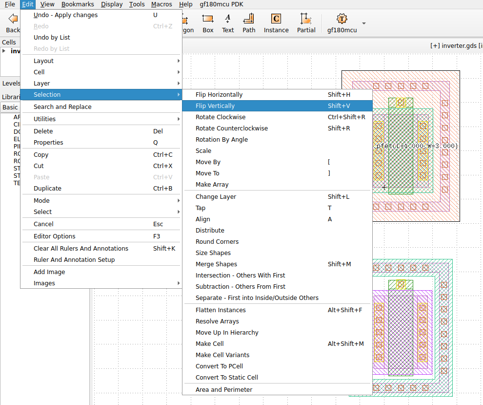
</p> 

<p align="center">
   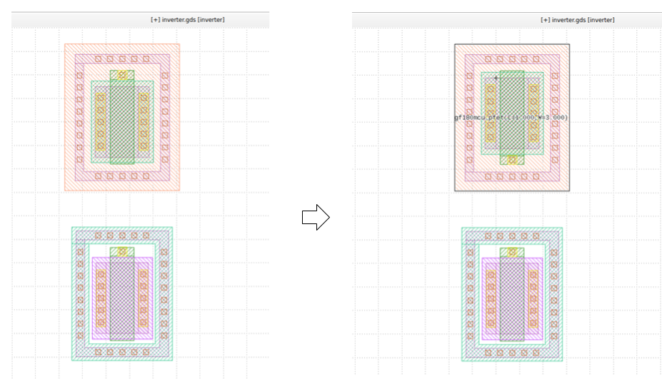
</p> 

Once you have finished instantiating and connecting the layout components, place the pin labels with the **Metal<n>_Label** layer as shown below and as indicated in the examples provided by the Chipathon 2025 repo (https://github.com/sscs-ose/sscs-chipathon-2025/tree/main/examples/analog_tutorial)

<p align="center">
   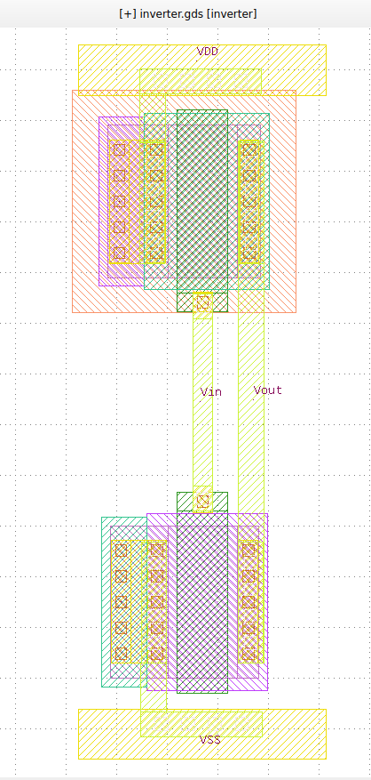
</p> 

## DRC flow

To run DRC flow, check the example **Tutorial using KLayout with gf180mcu (part 4)** in https://github.com/sscs-ose/sscs-chipathon-2025/tree/main/examples/analog_tutorial

Remember to set for **Klayout DRC Options**:
1) **Variant options**: *D*
2) **Top cell name**: inverter

The figure below shows DRC clean for the inverter layout cell.

<p align="center">
   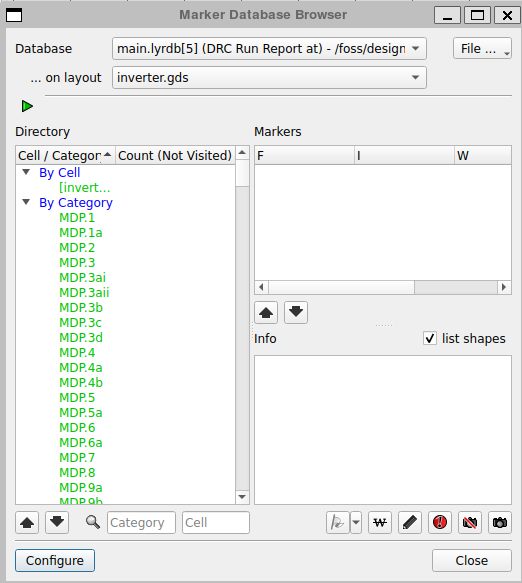
</p> 

## LVS flow

To run LVS flow, check again the example **Tutorial using KLayout with gf180mcu (part 4)** (link above), and set in Xschem the options defined below.

<p align="center">
   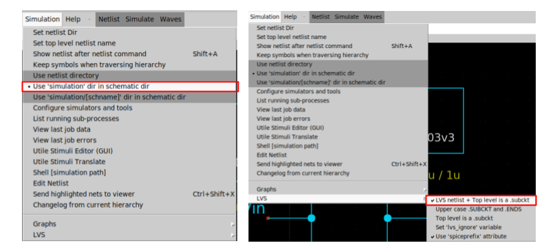
</p> 

Remember to set for **Klayout LVS Options**:
1) **Substrate name**: VSS
2) **Variant options**: D
3) **Top cell name**: inverter
4) **Netlist path**: /foss/designs/Chipathon2025_gf180/gf180_examples/inverter/xschem/simulation/inverter.spice

This fourth option is included in this tutorial compared with the **Tutorial using KLayout with gf180mcu (part 4)** mentioned above, since it is desirable in this Chipathon to maintain an organized structure, as proposed in this template link: https://github.com/JuanMoya/projectname_structure_template

Below, is an image with LVS clean.

<p align="center">
   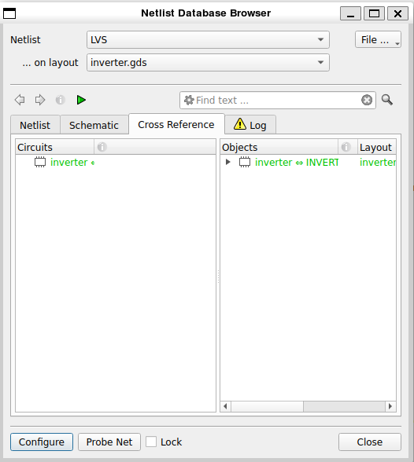
</p> 
