### Inverter setups
The different configurations and setups for waveform visualisation in Xschem are shown below.

Begore running the simulation, let's set the simulation results directory in the same path of the inverter schematic. For this, click on the **Simulation** menu and then select the option *Use 'simulation' dir in schematic dir*, as indicated below.

<p align="center">
   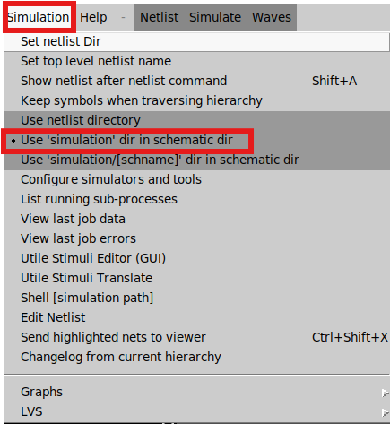
</p>  

Once you have set this path correctly, save the file and click on the *Netlist* button to generate the netlist. Then click on *Simulation* to run the simulation testbench.

## inverter_tb_none.sch
This testbench performs a DC simulation of the inverter. First, click on the **Simulation** button, then select the *Configure simulators and tools* option. Next, select **Ngspice Interactive** mode, as shown in the images below.

<p align="center">
   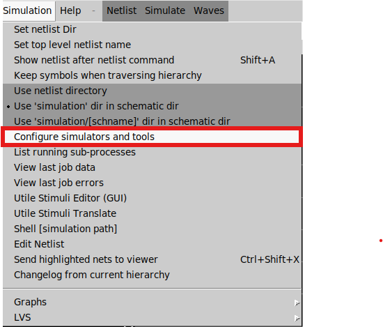
</p>  

<p align="center">
   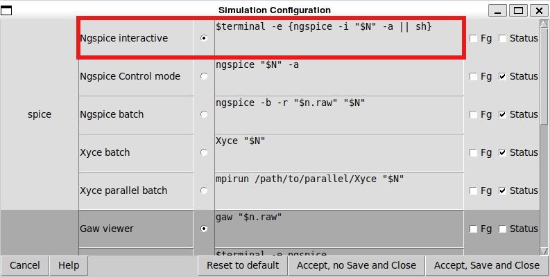
</p>  

Once the correct configuration has been set, the ngspice terminal opens, allowing you to plot the output using the following instruction: **plot Vout**.

<p align="center">
   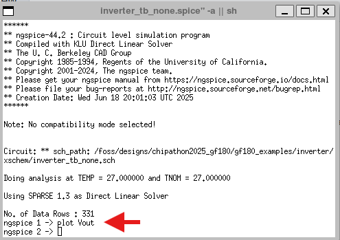
</p>  

Finally, the image below shows the results of the DC simulation for Vout versus Vin.

<p align="center">
   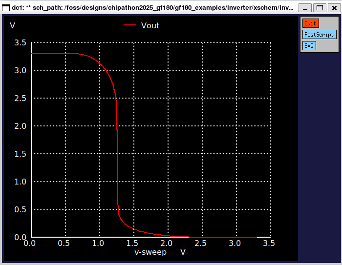
</p> 

## inverter_tb_tran_none.sch
This testbench runs a transient simulation for the same inverter, using the same configuration as below in **Ngspice interactive** mode.
To plot Vout and Vin together using the Ngspice terminal, enter the following command: **plot Vout Vin**.

<p align="center">
   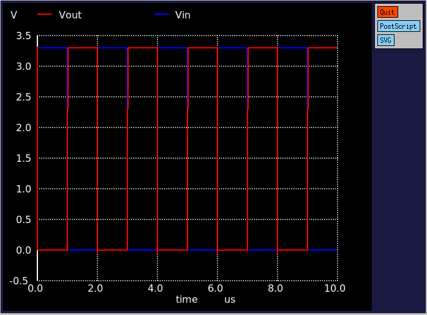
</p> 
 
One useful trick for achieving a better visualisation of the waveforms is to include an offset in one of the plotted waveforms. The following command illustrates this: **plot Vout+4 Vin**.

<p align="center">
   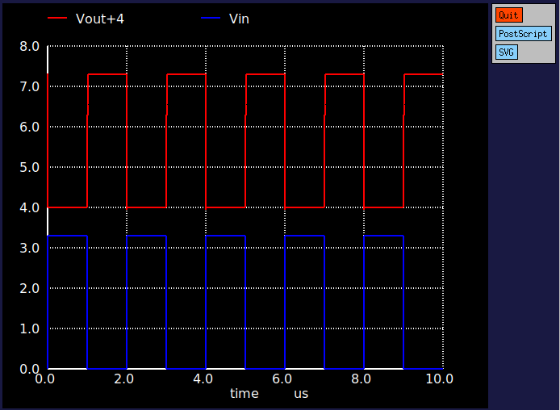
</p> 

## inverter_tb_tran_xschem.sch
This test bench runs transient simulations of the same inverter and uses the XSchem Visualizer, as shown in the figure below. It employs a distinct simulator mode and incorporates two modules, highlighted in red.

<p align="center">
   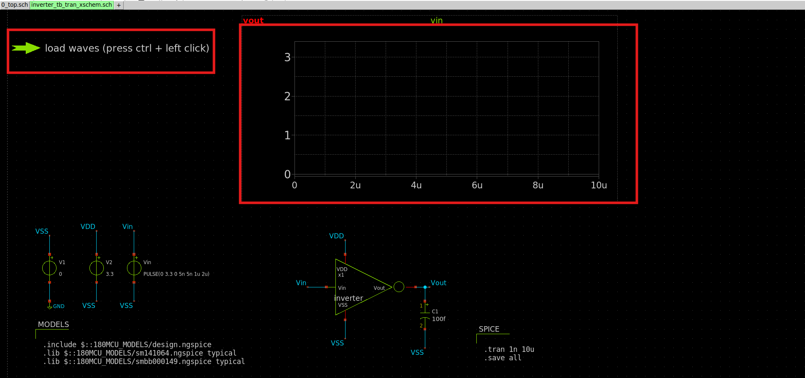
</p> 

Once you have set up the testbench correctly, click on the **Simulation** menu, then click on **Graphs** and select *Add waveform* and *Add waveform reload launcher* to include the two modules, as illustrated below.

<p align="center">
   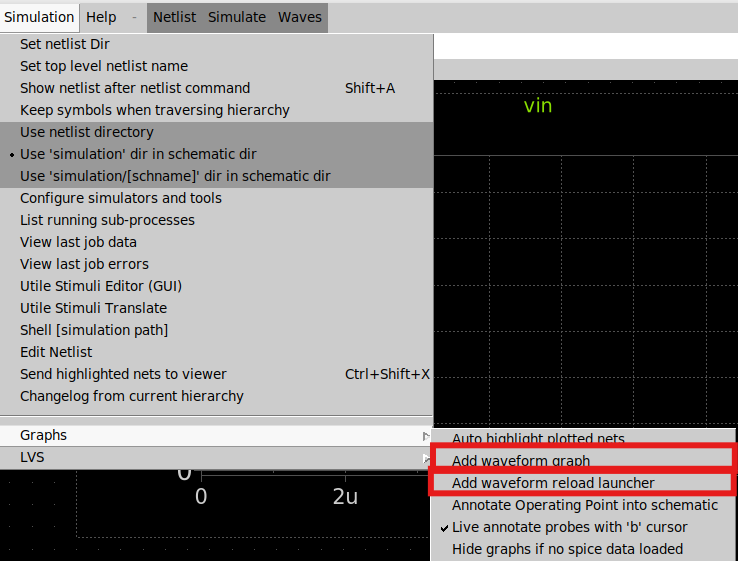
</p> 

Select the waveform, then press *Q* and modify the waveform configuration to include **Vout** and **Vin** in the graph.

<p align="center">
   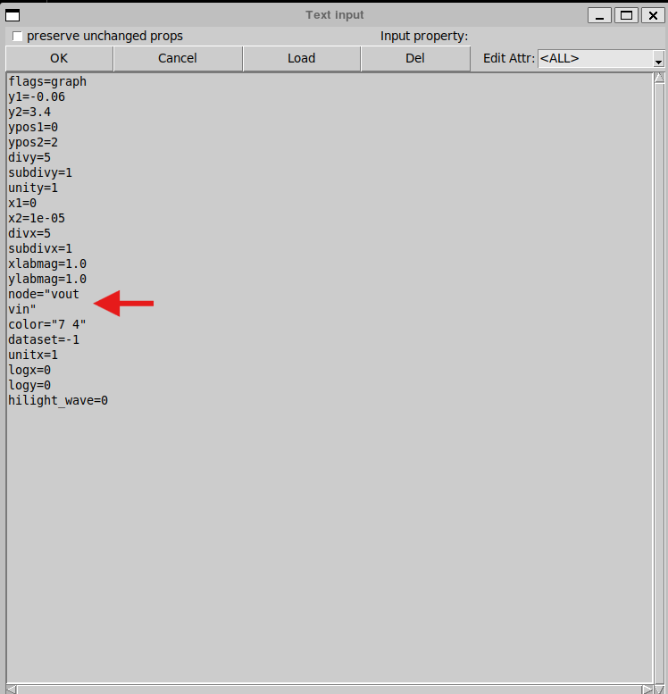
</p> 

Finaly, change the simulator mode to: **ngspice batch**  

<p align="center">
   
</p> 

Click on the *Netlist* and *Simulation* buttons. A new window will appear, as shown below.

 <p align="center">
   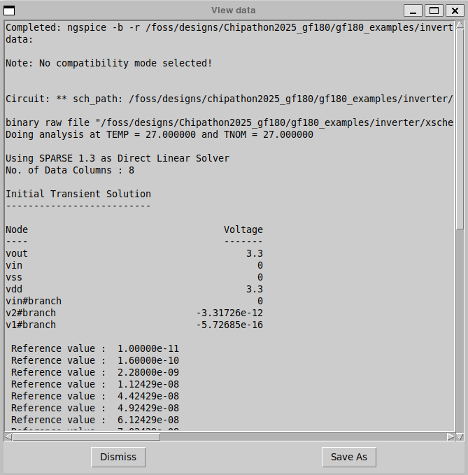
</p> 

Close the new window, click on the launcher and press the *Ctrl+left-click* combination as indicated in the symbol description to load the waves. Both **Vout** and **Vin** waveforms should then appear, as shown below.

 <p align="center">
   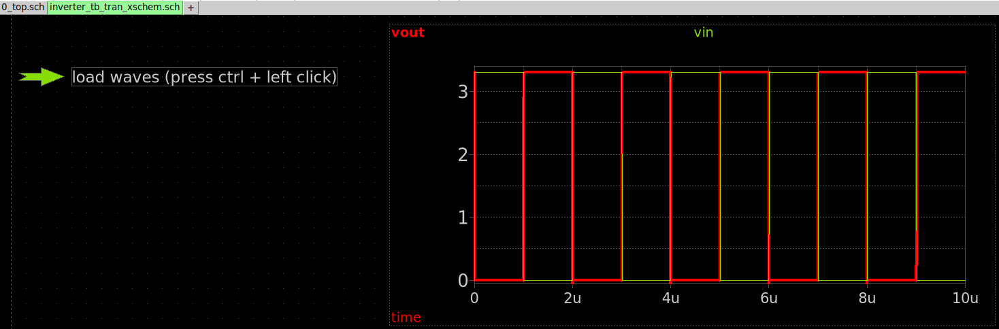
</p> 

**Reference:**
1) https://www.youtube.com/watch?v=qbf9CbWoX4w

## inverter_tb_tran_gaw.sch
This testbench runs a transient simulation for the same inverter, using the **Ngspice interactive** mode. Click on the *Netlist* and *Simulation* buttons. Then, click on *Waves* and select *External Viewer*, as indicated below. A new window pops up.

 <p align="center">
   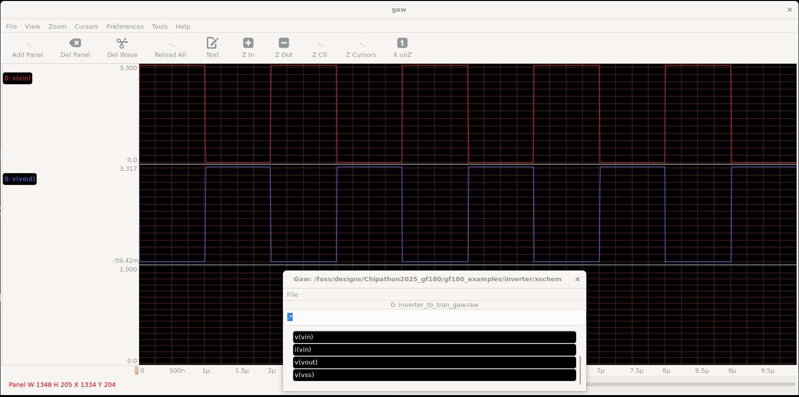
</p> 

Drag and drop from the list the waveforms that you want to check with gaw.

**References:**
1) https://www.youtube.com/watch?v=tfPqrM7VaEs
2) https://www.youtube.com/watch?v=bm3l21ExLOY&t=40s


## inverter_tb_tran_colab.sch
Below is the inverter testbench in Xschem that generates a .txt simulation results file, which will be located in the simulation folder mentioned at the beginning of this guideline. For this visualization mode, the simulator configuration is also: **Ngspice interactive**.

 <p align="center">
   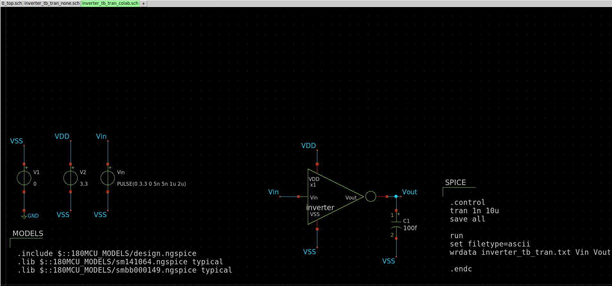
</p> 

The file will be located in your Windows machine in the path: $HOME\eda\designs\Chipathon2025_gf180\gf180_examples\inverter\xschem\simulation

This file can be uploaded to a google colab file for post processing as illustrated in the figure below.

 <p align="center">
   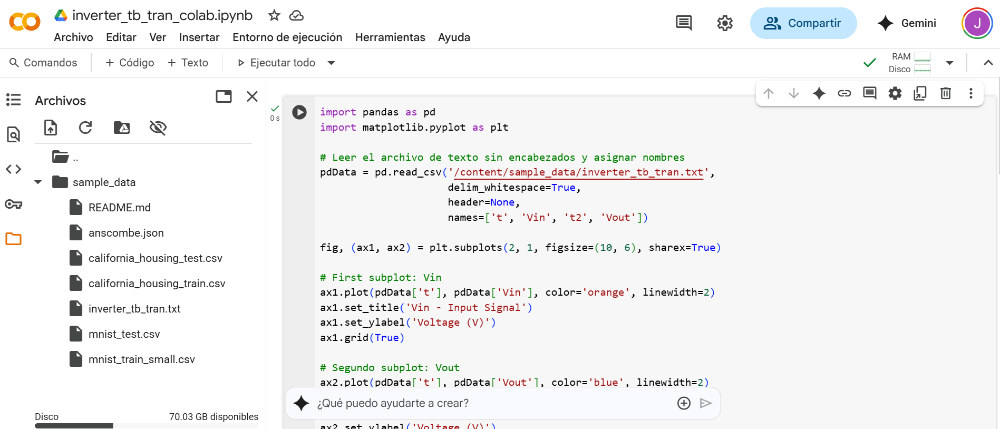
</p> 

 <p align="center">
   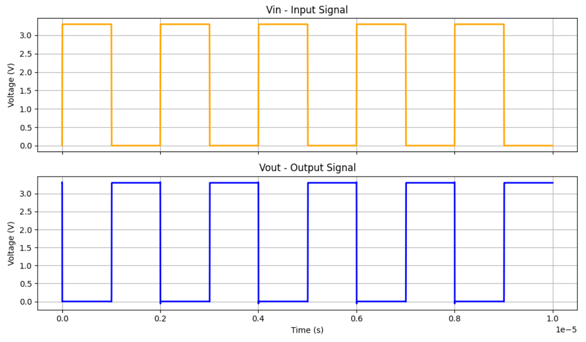
</p> 

Make sure to upload the inverter_tb_tran.txt file to the **sample_data** folder. The Google Colab script is also located in this folder as **script.txt**. Finally, here is the link to the Colab file: https://colab.research.google.com/drive/1SiDoTlFxrQ4vMiz5GE_YhqOSPYIMJ9dE?usp=sharing

## Hotkeys
In the Xschem GUI, select the **Help** option to access the *Keys* and *Show Keybindings* options. These allow you to view a list of the available key bindings and their descriptions, as well as a handy keybinding cheat sheet (see the image below).

<p align="center">
   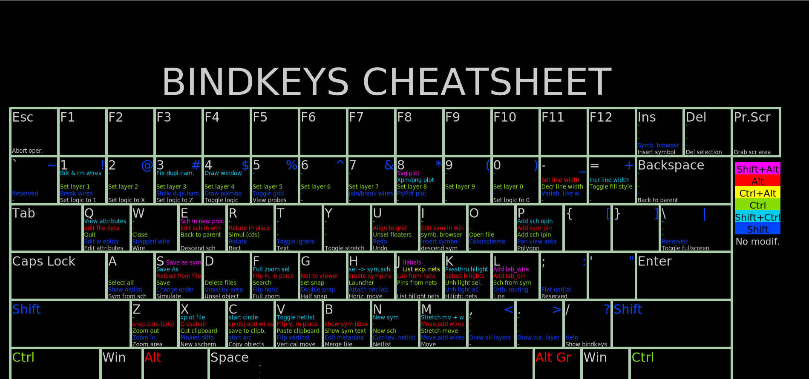
</p> 

Below are some of the most commonly used XSchem key bindings. More key bindings can be found via the following link or in the *Keys* menu option:
http://repo.hu/projects/xschem/xschem_man/commands.html

|Key1  | Key2 | Description Header |
| ------------- | ------------- | ------------- |
| -  | Delete  | Delete selected objects |
| -  | Escape  | Abort, redraw, unselect |
| -  | Down  | Move down |
| -  | Up  | Move up |
| -  | Left | Move left |
| -  | Right | Move right |
| -  | 'a' | Select all |
| ctrl  | 'e' | Back to parent schematic |
| -  | 'e' | Descend to schematic |
| -  | 'f' | Full zoom |
| shift | 'I' | Insert symbol |
| -  | 'm' | Move selected objects |
| ctrl  | 'm' | Move selected objects, stretching wires attached to them |
| alt  | 'r' | Rotate objects around their anchor points |
| shift  | 'R' | Rotate |
| ctrl  | 's' | Save schematic |
| shift  | 'U' | Redo |
| -  | 'u' | Undo |
| -  | 'w' | Place wire |
| -  | 'z' | Zoom box |
| shift  | 'Z' | Zoom in |
| ctrl | 'z' | Zoom out |

## Pulling and pushing the design project to a Github repository

The **IIC-OSIC-TOOLS** repo, create a mapped folder which is synced between host and the docker. By default its $HOME\eda\designs in Linux and C:\Users\<username>\eda\designs in Windows (which is this case). To pull your repository in your Windows machine, run the following commmand in Powershell: 

  ```
  git clone <your_repository>.git
  ```

Remember to generate an SSH key adding it to the ssh-agent, as indicated in the next link:
https://docs.github.com/en/authentication/connecting-to-github-with-ssh/generating-a-new-ssh-key-and-adding-it-to-the-ssh-agent

In my case, I generate the **RSA** key, not the **Ed25519**.

```
ssh-keygen -t rsa -b 4096 -C "your_email@example.com"
```

The most used commands are:
```
git add .
git commit -m "message describing the changes"
git pull commit main
git push commit main
```
Here is a link where you can find more information about git.
https://www.youtube.com/watch?v=mJ-qvsxPHpY
