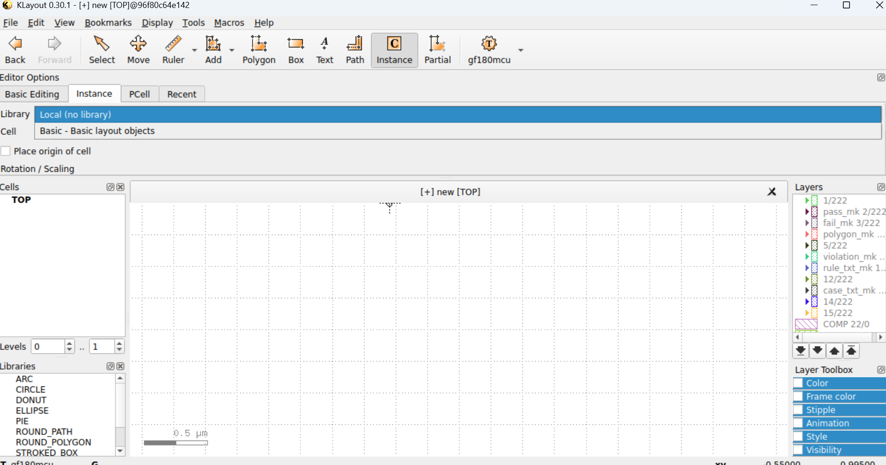
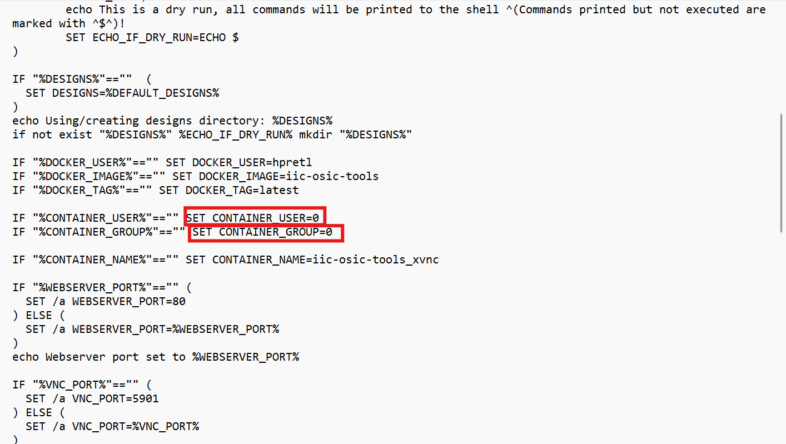
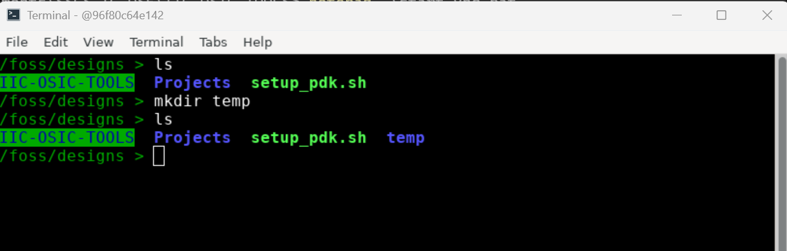
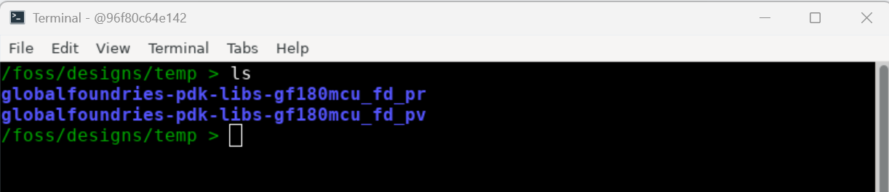
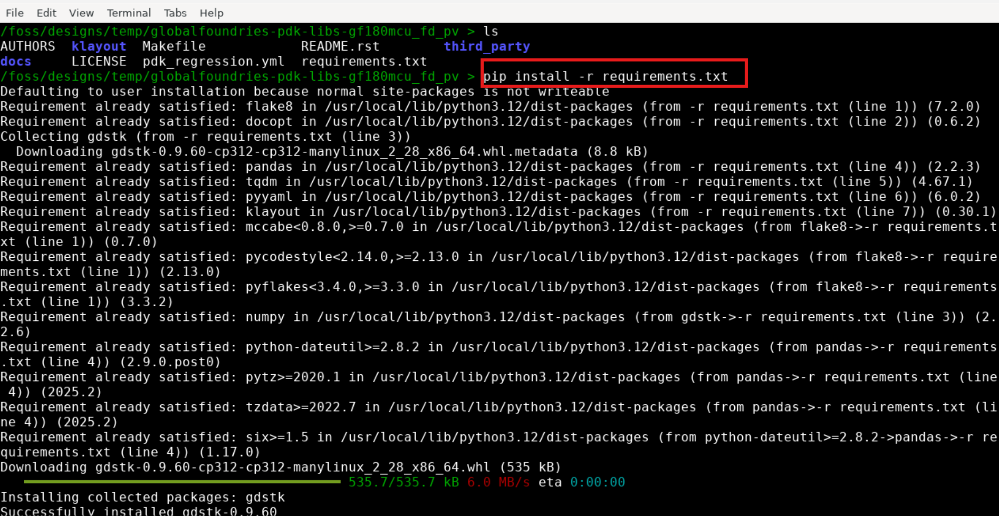

# gf180mcu pcell, drc, and lvs patch

<div style="border: 1px solid #f39c12; background-color: #fff3cd; padding: 10px; border-radius: 5px;">
  <strong>🚧 Under Construction:</strong> This section is being actively developed and will change.
</div>

When you open the Docker image terminal, type the following command:
  ```
  klayout -e
  ```
<p align="center">
   
</p>  

Klayout GUI pops up as indicated in the next image. 
<p align="center">
   
</p>  

It is important to mention that there are two red rectangles highlighting that klayout loaded ihp layer properties file correctly. To change the layer properties file to gf180mcu PDK, open setup_pdk.sh and do the following changes.
<p align="center">
   
</p>  

Save the file and source it:
  ```
    source setup_pdk.sh
  ```

Open again klayout.

<p align="center">
   
</p>  

It is possible to observe that there is only one gf180mcu label, compared with the first time klayout was opened (ihp configuration). This indicates that gf180 pcells were not loaded correctly, as illustrated in the next image:

<p align="center">
   
</p>  

The image above shows that in the Instance menu, no gf180mcu library is present (only Local and Basic libraries were loaded). To get access to the gf180mcu library, please do the following steps:

1) Exit the Docker image terminal.
2) In the **Power shell** terminal, open the file *.\start_vnc.bat* and do the following changes.
   a) set CONTAINER_USER=0
   b) set CONTAINER_GROUP=0
The previous changes allow you to do changes in the setup folders as root.

<p align="center">
   
</p> 

3) Create a temp file to download some repositories and do the changes.

<p align="center">
   
</p> 

Enter the *temp* file with:
  ```
    cd temp
  ```
4) Download the following 2 repositories:
  ```
    git clone https://github.com/efabless/globalfoundries-pdk-libs-gf180mcu_fd_pr.git
  ```
  ```
    git clone https://github.com/efabless/globalfoundries-pdk-libs-gf180mcu_fd_pv.git
  ```

These two repositories contain the files to load correctly the pcells and also the files to run DRC and LVS flows.
After running the two commands above, two new files are created inside the *temp* folder:

<p align="center">
   
</p> 

5) Inside the globalfoundries-pdk-libs-gf180mcu_fd_pv folder, run the following command:
  ```
    pip install -r requirements.txt
  ```
<p align="center">
   
</p> 

6) In the local gf180mcuD klayout folder of the Docker image, delete the folders **drc** and **lvs**
