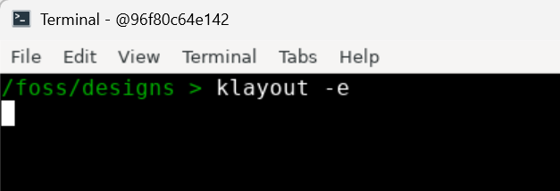
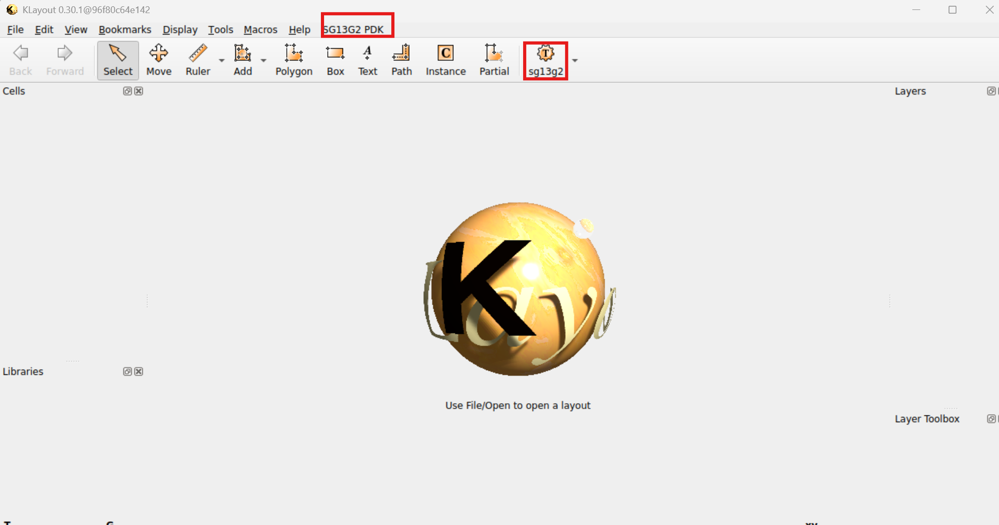
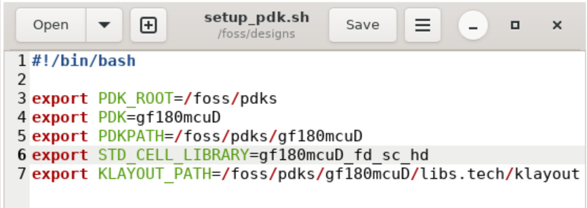
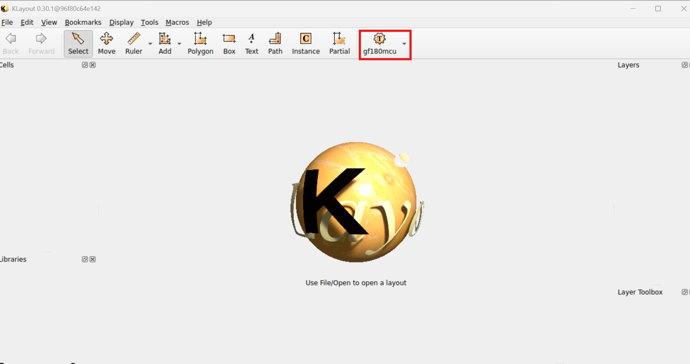

# gf180mcu pcell patch

When you open the Docker image terminal, type the following command:
  ```
  klayout -e
  ```
<p align="center">
   
</p>  

Klayout GUI pops up as indicated in the next image. 
<p align="center">
   
</p>  

It is important to mention that there are two red rectangles highlighting that klayout loaded ihp layer properties file correctly. To change the layer properties file to gf180mcu PDK, open setup_pdk.sh and do the following changes.
<p align="center">
   
</p>  

Save the file and source it:
  ```
    source setup_pdk.sh
  ```

Open again klayout.
<p align="center">
   
</p>  
